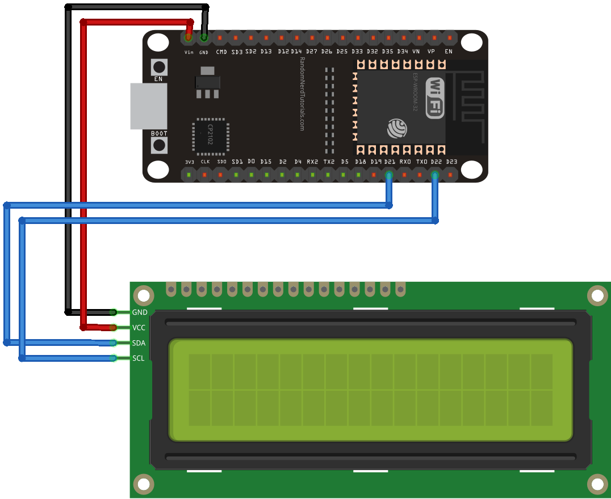
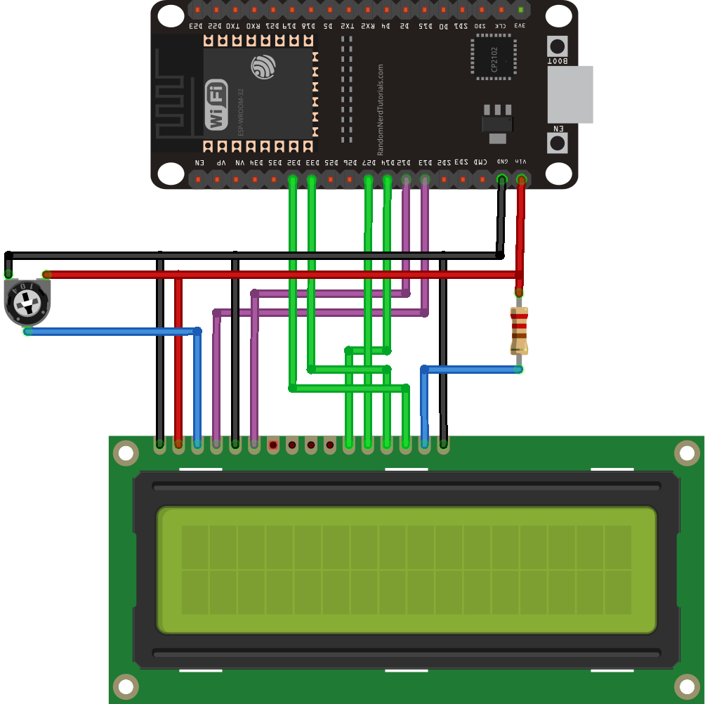

# ESP32-LCD-Weatherstation

A small weather station using only an ESP32 and a 16x2 LCD.

## Features

Our weather station has quite some special features:

* Displays weather data of current location
* Automatically switches language depending on location
* Automatic  detection of I²C or directly connected LCD

A little bit more hidden, but also relevant:

* Stutter free experience due to parallel processing
* Nice Icons
* No irrelevant information due to a neat and tidy layouted display

## Hardware Setup

Our weather station supports LCDs connected directly to the ESP32 as well as those controlled by I2C. The special thing about it: you don't have to change anything in the code - plug and play.

### I²C

| ESP32   | LCD |
|---------|-----|
| GND     | GND |
| VIN     | VCC |
| GPIO 21 | SDA |
| GPIO 22 | SCL |



### Direct

| ESP32                            | LCD     |
|----------------------------------|---------|
| GND                              | VSS     |
| VIN                              | VDD     |
| via potentiometer to VIN and GND | V0      |
| GPIO 13                          | RS      |
| GND                              | RW      |
| GPIO 12                          | E       |
| -                                | D0      |
| -                                | D1      |
| -                                | D2      |
| -                                | D3      |
| GPIO 14                          | D4      |
| GPIO 27                          | D5      |
| GPIO 33                          | D6      |
| GPIO 32                          | D7      |
| via 220Ω resistor at VIN         | A       |
| GND                              | K       |



## Software Setup

### Arduino IDE Setup

#### Install the ESP32 in the Arduino IDE

1. Start the Arduino IDE and open the Preferences (Ctrl + Comma)
1. Copy `https://dl.espressif.com/dl/package_esp32_index.json,` into "Additional Boards Manager URLs"
1. Restart the Arduino IDE
1. Open the Boards Manager `Tools -> Board -> Boards Manager`
1. Search for `esp32` and install `esp32 by Espressif Systems`

#### Install the libraries

Make sure that you have installed the following libraries:

| Name              | Author             | Part of Arduino Library Manager |
|-------------------|--------------------|---------------------------------|
| ArduinoJson       | Benoit Blanchon    | :heavy_check_mark:              |
| LiquidCrystal_I2C | Frank de Brabander | :heavy_check_mark:              |

1. Open the Library Manager (Ctrl + Shift + I)
1. Search for `ArduinoJson` and install `ArduinoJson by Benoit Blanchon`
1. Search for `LiquidCrystal I2C` and install `LiquidCrystal I2C by Frank de Brabander`

### Code Setup

#### WiFi Credentials

Create a folder named `data` inside the project folder.

Inside it, create a file named `wifi.cfg`.

Place these contents inside:

```json
{
	"ssid": "SSID",
	"pass": "PASSWORD"
}
```

Now replace `SSID` and `PASSWORD` with your WiFi Name and Password accordingly.

You then need to upload it using the 
[Arduino ESP32 filesystem uploader by me-no-dev](https://github.com/me-no-dev/arduino-esp32fs-plugin).

#### OpenWeatherAPI Key

You can get a free OpenWeatherAPI key by registering at [their homepage](https://home.openweathermap.org/users/sign_up).

Then create and/or open the file `keys.h` inside the project folder.
Paste in `#define OPENWEATHERAPI_KEY "key"` and replace `key` with your key.
The quotes must remain.

#### Optional parameters

The weather station can optionally be configured by changing some constants.

Parameter | Unit | Description | Default
--------- | ---- | ----------- | -------
WEATHER_CHANGE_SCREEN | Seconds | How often the weather station should switch the displayed values. | 5
WEATHER_UPDATE_INTERVAL | Minutes | How often the displayed weather data should be updated. | 5
POSITION_UPDATE_INTERVAL | Hours | How often the position data should be updated. | 2

### Code Upload

1. Plug in the ESP32 via USB into your PC
1. Open `Tools -> Board` and select `ESP32 Dev Module`
1. Open `Tools -> Port` and select the port were your ESP32 is connected to (usually the highest number)
1. Upload the sketch (Ctrl + U)